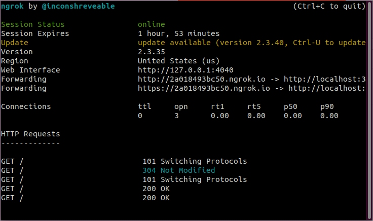
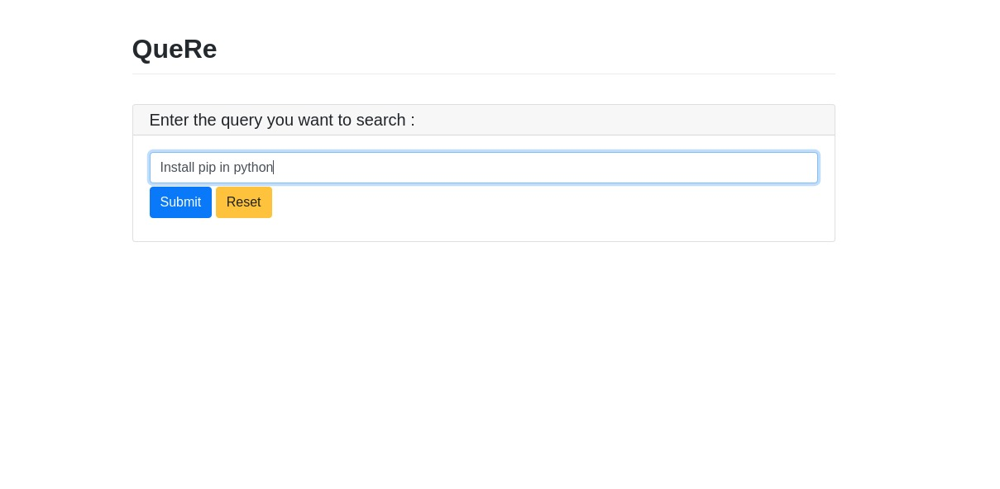
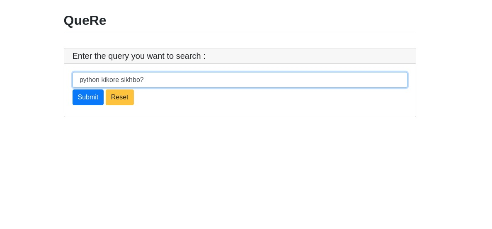
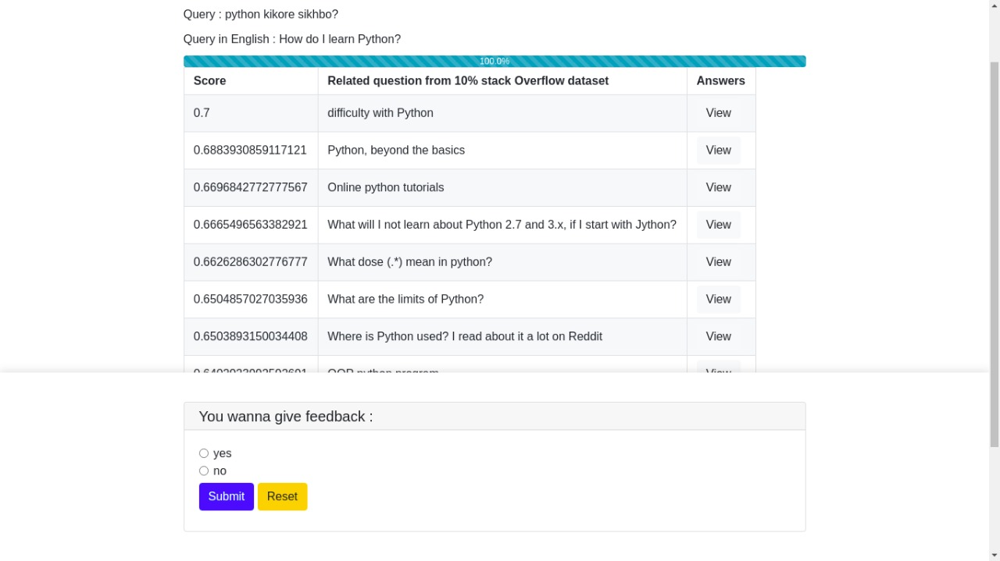

# QueRe

QueRe is an effective end-to-end Question-Answer retrieval system capable of retrieving a ranked list of relevant Question-Answer pairs against a user query.

## Requirements

Download and install Elasticsearch using the [guide documentation](https://www.elastic.co/guide/en/elasticsearch/reference/current/install-elasticsearch.html)

Download [USE](https://tfhub.dev/google/universal-sentence-encoder/4)(universal-sentence-encoder) version 4. Unzip the downloaded file and store the folder inside the finalProjectCode folder.

Download and install the ngrok using the [documentation](https://ngrok.com/download).

Download the following files from the google drive and store them inside the finalProjectCode folder with the names : 
[embeddings_9may](https://drive.google.com/file/d/1-06E7te5tfqJf4UZfyC8KfT3uiNy0ZGN/view?usp=sharing), 
[ids_8may_full](https://drive.google.com/file/d/1-9a9kbrAMkmAbCRrbfMugs29ZVuLui_u/view?usp=sharing),
[Questions.csv](https://drive.google.com/file/d/1TIb585CWFiH4iFoCFbhAsctuKoxIMiT7/view?usp=sharing) and [Answers.csv](https://drive.google.com/file/d/1vUbqy8_km_SVUt-zN6oTZu7vPCntwx0I/view?usp=sharing).


## Installation

Use the package manager [pip](https://pip.pypa.io/en/stable/) to install the following commands.

```bash
pip install pywebio
pip install contractions
pip install scipy
pip install bs4
pip install joblib
pip install tensorflow
```

## Usage
Run Elasticsearch using the [guide documentation](https://www.elastic.co/guide/en/elasticsearch/reference/current/starting-elasticsearch.html)

Create the index of Elasticsearch by running the following python files using the terminal.

```bash
python createJsonFile.py
python keyword_indexing.py
```

Once the indexing is created, fire up ngrok in new terminal.

```bash
ngrok http 3000

```


Run the python file searching.py in new terminal.
```bash
python searching.py
```
Run the http or https URL of the ngrok to start the server on your browser.


Enter the Query in English Language


Results on Submitting the Query


View answer of selected question result


Enter the Query in Bangla Language


Results on Submitting the Query



## Contributing
Pull requests are welcome. For major changes, please open an issue first to discuss what you would like to change.

Please make sure to update tests as appropriate.

